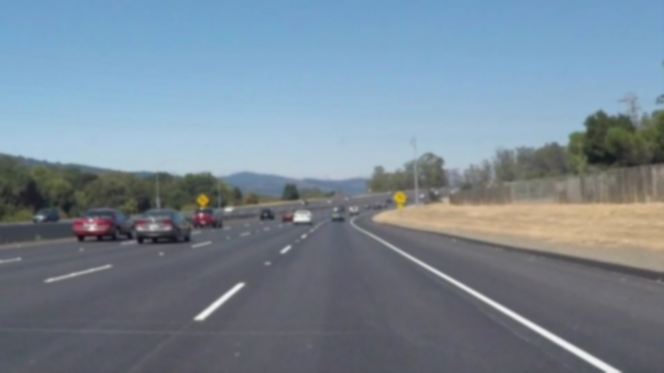
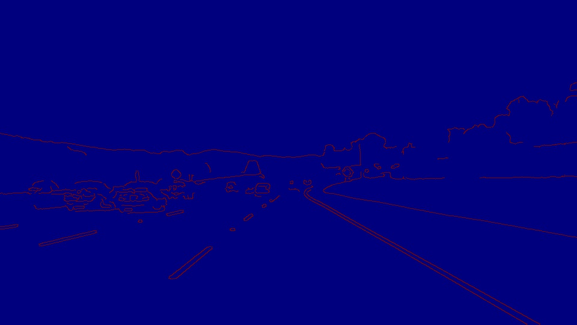
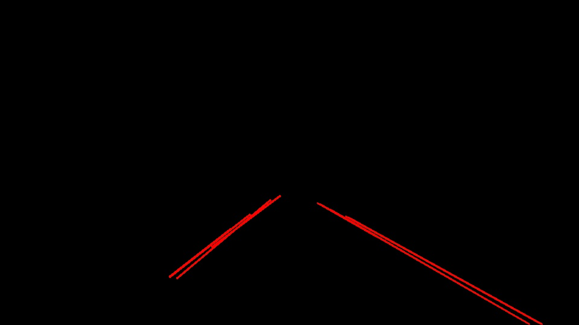
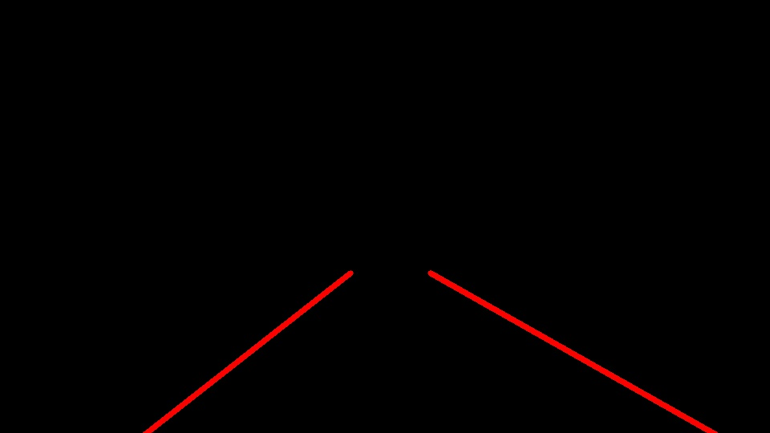
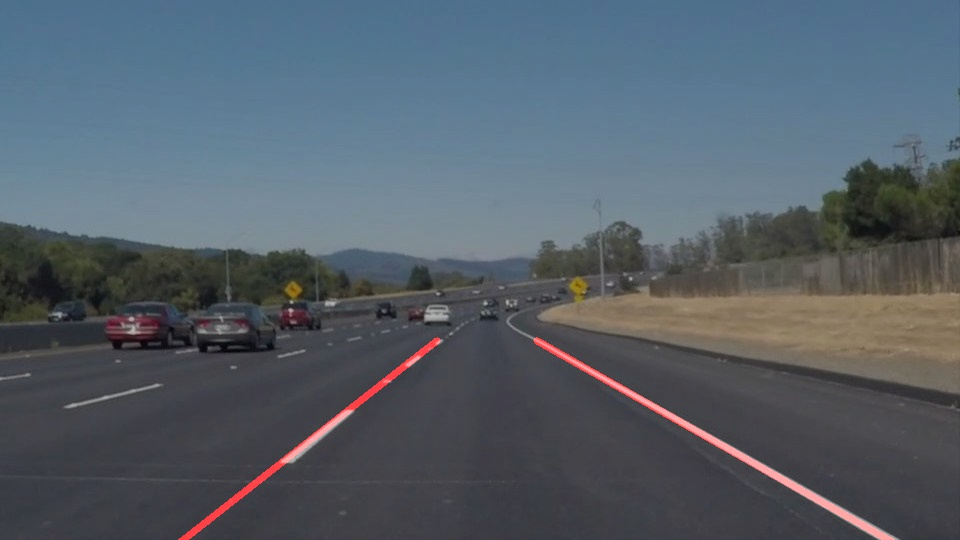

# **Finding Lane Lines on the Road** 
The first step to creating self driving car is to understand the road and making sure that a car is able to follow a certain path. A lot of the vehicles today can support a front viewing camera which can be used to capture the immediate environment that the car is going to enter and make decisions based on that environment. For example, cameras provide information of whether there is a pedastrian in sight of the car. Here is an example of what the camera sees.


So in this project, we use video frames and images generated by such camera to detect road lanes which allow the car to position itself when self-driving.

<hr>

## **Pipeline**
An image by nature contains a lot of noise (sharp granular pixels) which can affect the performance of our model. Therefore, it is a good practice to smoothen out the image. One common technique is to use Gaussian filter which blurs the image and removes granular details which will make our model perform better. Here is the output of Gaussian filter applied to our original image. 



In order to detect lanes we need a way of finding edges. OpenCV provides a function called **Canny** which we will used to detect edges. Edges are defined as sudden change in contrast which is referred to as gradient mathematically. Since our image is stored in a 2-D array (X, Y), we need to check the gradients in X direction and in Y direction independently. If we run the gradient in X direction, we will get the vertical edges and similarly if we run the gradient in Y direction, it will find the horizontal edges. 
Here is Canny applied to our original image.



As seen, we are getting edges for the entire image. We are only interested in the edges that constitute the lanes. For this reason, we create a mask defined by a polygon and only retreive region that we are interested in. Here is what we get after applying the mask.


Canny returns a binary image which contains edges. Edges can be either lines, corners points or any arbitrary object. Since we are only focusing on our masked image, most of our edges actually correspond to lines. But we still need a way to filter out unecessary edges and only keep straight lines. We use Hough transform to do this. The way that Hough transform works is it parametrizes our image into different space and then apply voting to find set of lines. Here is the output after applying Hough Transform.



As we can see, there are multiple lines outputted by Hough Transform. I modified the `draw_lines()` function in order to generalize these lines. Firstly I seperated the lines into left lines and right lines based on the sign of the slope. Then I took average of each set of lines using `np.mean()` which returns the mean points. Here is the sample output of using `np.mean()`.
```python
lines = [[[531, 339, 877, 538]],
        [[578, 361, 898, 538]],
        [[548, 348, 865, 531]],
        [[573, 359, 895, 537]],
        [[526, 337, 624, 393]]]
print(np.mean(lines, axis = 0))
[[551 348 831 507]]
```
After obtaining the average line (left and right), we needed to extend them to cover the area of interest. In order to extend the line, I simply created a line equation `(y = m * x + b)` using my average line. Then I simply passed in an `x` value to compute `y` and vice versa when we know the `y` value.
The following image shows the output of such method.



After all these step, we can overlay the above image onto our original image to get this.




[//]: # (Image References)

[image1]: ./examples/grayscale.jpg "Grayscale"

<hr>

## **Shortcomings**
Even though our pipeline is able to detect lane accurately, there are several limitations.

1. **Parameters** : Our pipeline contains several hyper parameters which need to be tweaked manually. Finding the optimal set of parameters would be time consuming.
2. **Not Invarirant** : Such a model is not able to generalize to a new set of data. For example, if the picture was taken during night, our pipeline would fail to detect lines accurately.

<hr>
