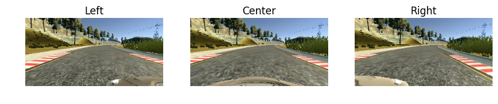
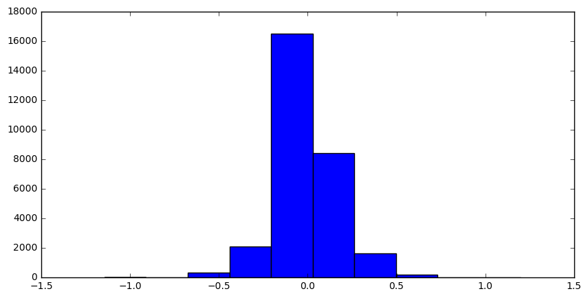

# **Behavioral Cloning**
---
#### ** Purpose **  
The purpose of this project is to teach an agent how to drive without a need of human control. At first it seems that this task would require a lot of feature engineering and building different models of prediction. But rather than doing that we rely on using deep learning to clone how humans drive. The problem is framed in such a way that we can simply collect image data from cameras mounted in front of the car and pair that with steering data to build an autonomous agent.

---
#### ** Data Processing **  

The data consists of images taken from front of the car. Specifically, there are three images for each timestamp: center, left, and right.
After playing around with the sample dataset provided with the project, I found that it was enough to develop a fairly accurate model. The following is a sample image.  

Since we only have one common steering measurement per set of image (left, center, and right), I added some offset to the steering angle when loading left and right image data. I picked 0.2 since it worked best after experimenting with other offset values.

Also the simulation track 1 has more left turns than right turns (counterloop). This makes our dataset unbalanced and make our model biased. When using the raw data without any augmentation, I found that the output model would make left turns every now and then. In order to solve this, I flipped each center image and added that to our dataset. Since we flipped the image, we would also need to flip the steering angle. We do this by simply multiply steering angle by -1.

Here is the distribution plot for steering angles.

---
#### ** Model **  

Now that we have our data, we can build a model. Given the images we want to predict the steering angle. Since the steering angle is continuous this is a regression problem. We can use convolutional neural networks to do regression where the final layer consists of only one node corresponding to the steering angle. In terms of architecture, I experimented with architecture documented in [Nvidia's paper](https://arxiv.org/abs/1604.07316). Here is the architectural diagram.

After implementing and testing the model using Keras, I found that it didn't perform well. The car would drive off road when there were sharp turns. One possible reason is that the data we have is not enough to learn accurately. Rather than collecting more data I wanted to experiment with different architectures. I came across a model by Comma and experimented with it. Here is the model architecture.

Firstly, we preprocess the images using normalization and cropping the irrelevant information. Then we stack convolution layers with ELU activations. Finally we add dropout and dense layers to predict the final output. We use MSE as our loss function and use 'adam' optimization method for faster convergence.

I used 20% of the data as validation set when training the model.
